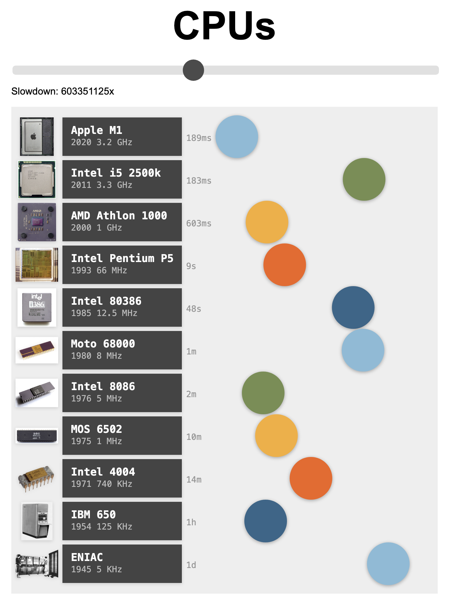

# CPUs

Visualizing the speed of CPUs throughout history.

## Adding another CPU

To add a CPU, make a PR that contains:

* (A) A new entry in [data.js](./data.js)
* (B) A image with the appropriate name in the [img](./img) directory

